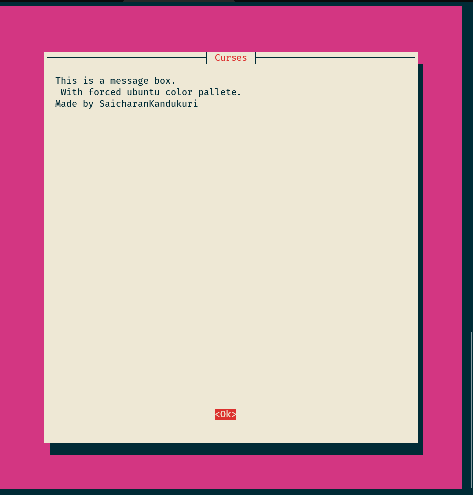

# Whiptail with ubuntu color palette

this repositary is an example to show:

- how to add custom color palette to whiptail.
- add better box heigh and width with 20% padding



## ubuntu newt color palette

```bash
root=,magenta
checkbox=,magenta
entry=,magenta
label=magenta,
actlistbox=,magenta
helpline=,magenta
roottext=,magenta
emptyscale=magenta
disabledentry=magenta,
```

<hr>

## All color palette values

```txt
root                  root fg, bg
border                border fg, bg
window                window fg, bg
shadow                shadow fg, bg
title                 title fg, bg
button                button fg, bg
actbutton             active button fg, bg
checkbox              checkbox fg, bg
actcheckbox           active checkbox fg, bg
entry                 entry box fg, bg
label                 label fg, bg
listbox               listbox fg, bg
actlistbox            active listbox fg, bg
textbox               textbox fg, bg
acttextbox            active textbox fg, bg
helpline              help line
roottext              root text
emptyscale            scale full
fullscale             scale empty
disentry              disabled entry fg, bg
compactbutton         compact button fg, bg
actsellistbox         active & sel listbox
sellistbox            selected listbox
```

> Source/READMORE at: [askubuntu](https://askubuntu.com/questions/776831/whiptail-change-background-color-dynamically-from-magenta/781062#781062)
